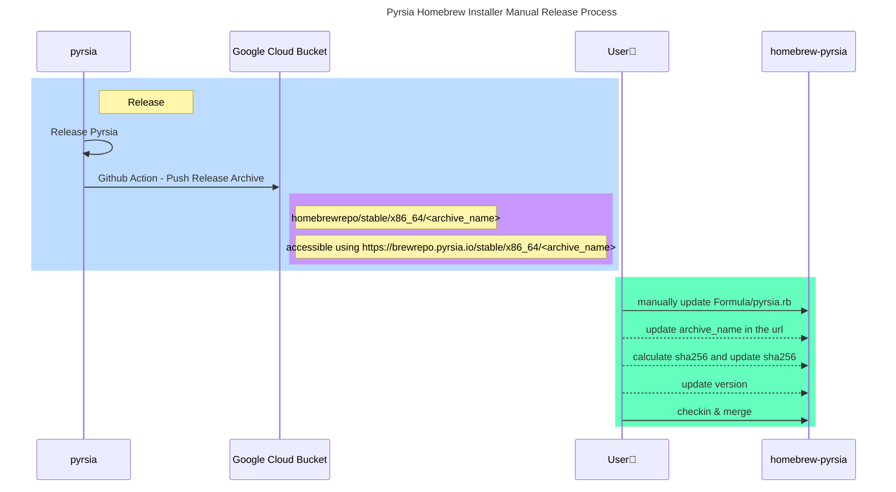

# homebrew-pyrsia
Homebrew formula for the Pyrsia on macOS

## Quick Installation Guide
Pyrsia can now easily be setup on a local macOS machine by using Homebrew package manager while tapping our Pyrsia Taps 
(Third-Party Repositories).

### Install

#### From the CLI

```shell
brew tap pyrsia/pyrsia
brew install pyrsia
```

On successful installation, you can test the binary package by using `brew test pyrsia`. On successful test execution, 
you can start Pyrsia Node as a background process using `brew services start pyrsia`. To 
check the service status, you can use `brew services list`. This lists all the services managed by `brew services`.
Pyrsia should appear in the list.

```text
Name    Status  User   File
pyrsia  started <user> ~/Library/LaunchAgents/homebrew.mxcl.pyrsia.plist
unbound none  
```

If you choose to stop the service at any point of time, use `brew services start pyrsia`.


Now Homebrew can track, update, and install Pyrsia installer for macOS

### Run Pyrsia Node
```
export RUST_LOG=info
pyrsia_node -H 0.0.0.0
```
This will start your local Pyrsia node with `info` logs. (you can also skip `export RUST_LOG=info` if you don't want logs. You can also set this to `export RUST_LOG=debug` to see even more logs)

### Verify everything is running smoothly

#### Check installed Version
```
$ pyrsia --version
pyrsia 0.2.0
```
#### Ping test
```
$ pyrsia ping
Connection Successful !!
```

## Installer Release Guide

Following sequence diagram demonstrate what needs to be done after successful release of Pyrsia to update the macOS installer.

